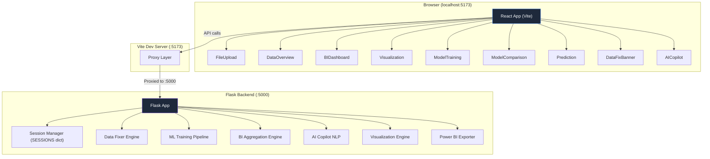
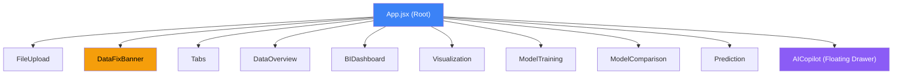
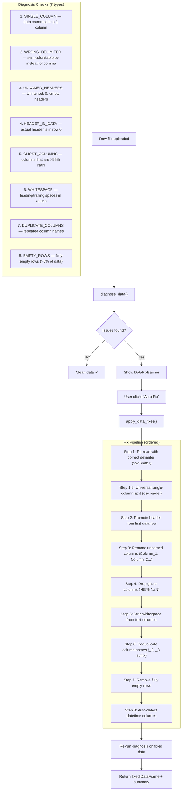
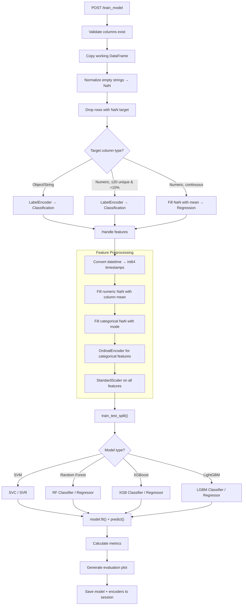
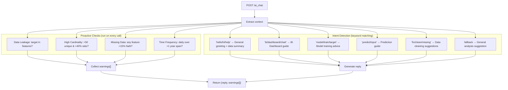
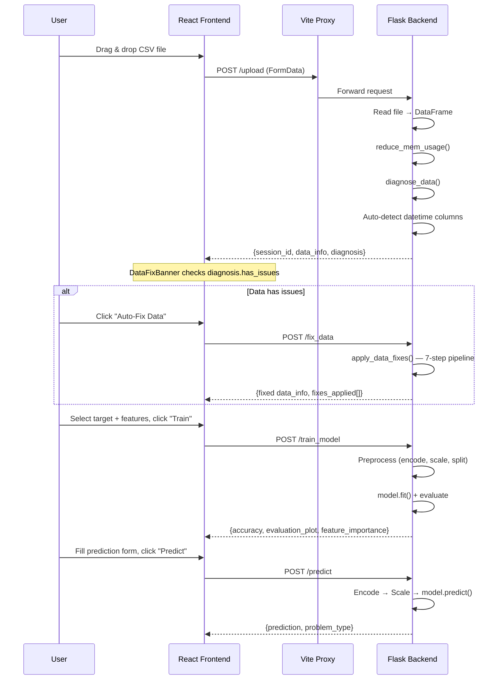
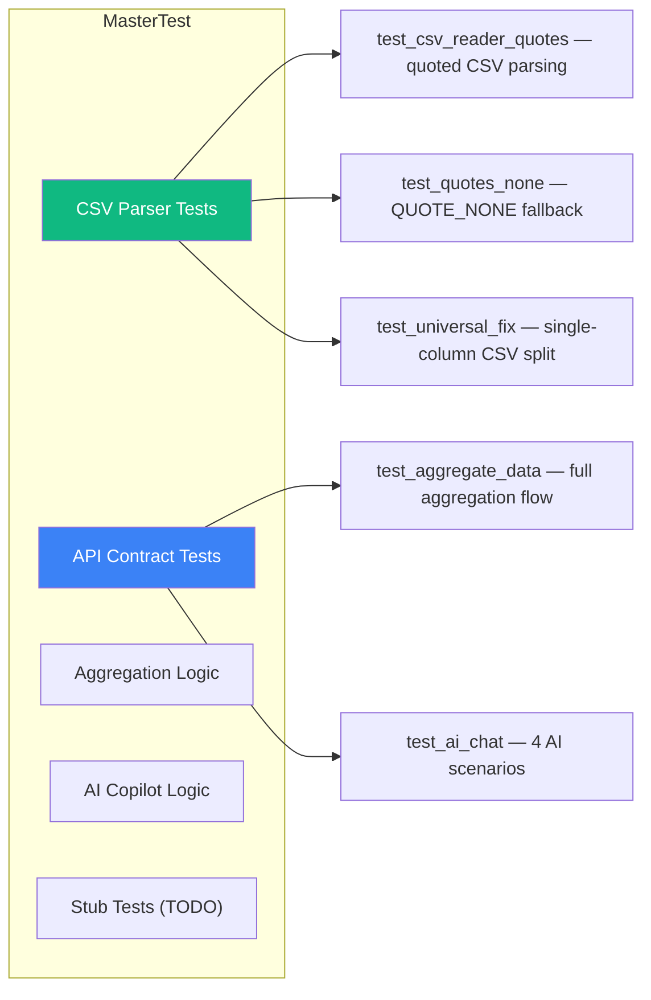
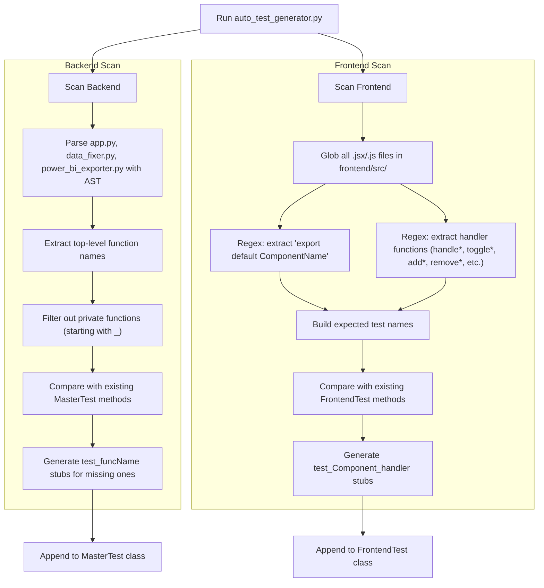

# AutoML Data Analytics App — Architecture & Testing Guide

> **Full-stack AutoML platform** for uploading datasets, visualizing data, building BI dashboards, training ML models, making predictions, and getting AI-powered guidance — all from a single app.

---

## Table of Contents

- [1. Tech Stack](#1-tech-stack)
- [2. System Architecture](#2-system-architecture)
- [3. Project Structure](#3-project-structure)
- [4. Backend Deep Dive](#4-backend-deep-dive)
- [5. Frontend Deep Dive](#5-frontend-deep-dive)
- [6. Complex Logic Breakdown](#6-complex-logic-breakdown)
- [7. Data Flow](#7-data-flow)
- [8. Testing Architecture](#8-testing-architecture)
- [9. How to Run Tests](#9-how-to-run-tests)
- [10. Troubleshooting](#10-troubleshooting)

---

## 1. Tech Stack

### Backend
| Technology | Version | Purpose |
|---|---|---|
| **Python** | 3.14+ | Core language |
| **Flask** | latest | REST API server |
| **Flask-CORS** | latest | Cross-origin requests |
| **Pandas** | latest | Data manipulation engine |
| **NumPy** | latest | Numerical computations |
| **scikit-learn** | latest | ML models (SVM, Random Forest), preprocessing, metrics |
| **XGBoost** | latest | Gradient boosted trees |
| **LightGBM** | latest | Fast gradient boosting |
| **Matplotlib** | latest | Server-side plot generation |
| **Seaborn** | latest | Statistical visualizations |
| **openpyxl** | latest | Excel file I/O |

### Frontend
| Technology | Version | Purpose |
|---|---|---|
| **React** | 19.x | UI component framework |
| **Vite** | 8.x | Dev server + bundler |
| **Plotly.js** | CDN | Client-side BI charts |
| **Vanilla CSS** | — | Design system (glassmorphism, Inter font, dark theme) |

### DevOps / Tooling
| Tool | Purpose |
|---|---|
| `run.py` | Dual-server launcher (Flask + Vite) |
| `git_push.py` | Interactive git automation with .gitignore management |
| `auto_test_generator.py` | Auto-discovers functions/components and generates test stubs |
| `refactor.py` | Code refactoring automation (logging migration) |

---

## 2. System Architecture



### How the Two Servers Communicate

1. **Vite Dev Server** runs on `localhost:5173` — serves the React frontend
2. **Flask API** runs on `localhost:5000` — handles all data/ML/AI logic
3. **Vite Proxy** in `vite.config.js` forwards all API routes (`/upload`, `/aggregate`, `/train_model`, etc.) from `:5173` → `:5000`
4. The user only interacts with `:5173` — all API calls are transparent

---

## 3. Project Structure

```
data-analytics-app/
│
├── app.py                      # Main Flask server (1,718 lines) — ALL API endpoints
├── data_fixer.py               # Smart Data Fixer — diagnosis + auto-fix pipeline
├── power_bi_exporter.py        # Power BI CSV export utility
├── run.py                      # Dual-server launcher (Flask + Vite)
├── refactor.py                 # Code refactoring automation
├── git_push.py                 # Interactive git push tool
│
├── master_test.py              # Test suite (MasterTest + FrontendTest)
├── auto_test_generator.py      # Auto-discovers missing tests and generates stubs
│
├── uploads/                    # Temporary file storage (auto-cleaned)
├── templates/                  # Legacy Jinja2 templates
│
├── frontend/                   # React + Vite frontend
│   ├── package.json
│   ├── vite.config.js          # Proxy config for API routes
│   ├── index.html
│   └── src/
│       ├── main.jsx            # React entry point
│       ├── App.jsx             # Root component — state management + routing
│       ├── App.css
│       ├── index.css           # Full design system (1,398 lines)
│       └── components/
│           ├── FileUpload.jsx      # Drag-and-drop file upload
│           ├── Tabs.jsx            # Tab navigation
│           ├── DataOverview.jsx    # Dataset shape, columns, first rows
│           ├── BIDashboard.jsx     # BI drag-and-drop dashboard + Plotly charts
│           ├── Visualization.jsx   # Matplotlib-generated plots
│           ├── ModelTraining.jsx    # ML model training + Power BI export
│           ├── ModelComparison.jsx  # Side-by-side model comparison
│           ├── Prediction.jsx      # Auto-fill prediction form
│           ├── DataFixBanner.jsx   # Smart data fixer warning banner
│           └── AICopilot.jsx       # AI advisor drawer with NLP chat
│
├── app.log                     # Flask application logs
├── data_fixer.log              # Data fixer operation logs
├── power_bi.log                # Power BI export logs
└── test.log                    # Test execution logs
```

---

## 4. Backend Deep Dive

### 4.1 Session Management

The app uses an **in-memory session store** (`SESSIONS` dict) instead of a database. Each upload creates a UUID-keyed session:

```python
SESSIONS[session_id] = {
    'data': None,              # pandas DataFrame — the active dataset
    'model': None,             # Trained scikit-learn model object
    'scaler': None,            # StandardScaler fitted on training data
    'target_encoder': None,    # LabelEncoder for classification targets
    'target_is_classification': False,
    'feature_columns_final': None,     # Column names after encoding
    'feature_columns_categorical': None,
    'feature_stats': None,     # Mean/min/max per feature (for prediction UI)
    'categorical_encoder': None, # OrdinalEncoder for categorical features
    'raw_file_bytes': None,    # Original file bytes (for Smart Data Fixer re-parse)
    'raw_filename': None,
    'diagnosis': None,         # Data quality diagnosis result
    'bi_data': None,           # Aggregated BI data (for export)
    'latest_prediction': None  # Last prediction result (for export)
}
```

> [!IMPORTANT]
> Sessions live in memory only — restarting the Flask server clears all sessions. This is by design for a dev/demo tool.

### 4.2 API Endpoints

| Endpoint | Method | Component | Purpose |
|---|---|---|---|
| `/upload` | POST | FileUpload | Upload CSV/XLSX, auto-detect dtypes, run diagnosis |
| `/visualize` | POST | Visualization | Generate Matplotlib plots (histogram, scatter, box, correlation, pair, strip) |
| `/train_model` | POST | ModelTraining | Full ML pipeline: clean → encode → scale → train → evaluate |
| `/compare_models` | POST | ModelComparison | Train SVM + RF + XGBoost side-by-side |
| `/predict` | POST | Prediction | Run single-row prediction through trained model |
| `/get_sample_row` | POST | Prediction | Auto-fill form by searching existing data |
| `/aggregate` | POST | BIDashboard | Power BI-style GROUP BY + aggregation engine |
| `/fix_data` | POST | DataFixBanner | One-click auto-fix pipeline |
| `/ai_chat` | POST | AICopilot | NLP-powered advisory + proactive diagnostics |
| `/export` | GET | DataOverview | Export raw/BI/prediction data as CSV/XLSX |
| `/export_power_bi` | POST | ModelTraining | Export cleaned dataset for Power BI |
| `/data_summary` | GET | — | Full describe() statistics |
| `/stats_analysis` | POST | — | Advanced stats (correlation, missingness, value counts) |
| `/feature_info` | GET | — | Return trained feature columns + stats |
| `/ping` | GET | — | Health check |

---

## 5. Frontend Deep Dive

### 5.1 Component Hierarchy



### 5.2 State Management

All state is managed via React `useState` hooks in **App.jsx** and lifted to child components via props:

| State Variable | Shared With | Purpose |
|---|---|---|
| `sessionData` | All components | Session ID + data_info + diagnosis |
| `activeTab` | AICopilot, Tabs | Current visible tab |
| `biDimensions`, `biMeasures` | BIDashboard, AICopilot | BI configuration (for AI diagnostics) |
| `trainTarget`, `trainFeatures` | ModelTraining, AICopilot | ML config (for leakage detection) |
| `aiDrawerOpen` | App layout | Controls main content padding shift |

### 5.3 Design System

The CSS in `index.css` (1,398 lines) implements:

- **Glassmorphism** — `backdrop-filter: blur(16px)` with semi-transparent panels
- **Dark theme** with CSS variables (`--color-bg: #0f172a`)
- **Light theme** toggle via `[data-theme="light"]`
- **Inter font** from Google Fonts
- **Animated gradient borders** (Data Fix Banner)
- **Drag-and-drop** UI for BI Dashboard
- **AI Copilot drawer** with typing indicators, chat bubbles, suggestion chips
- **Micro-animations**: fadeIn, shimmer, pulse, gradient shifts

---

## 6. Complex Logic Breakdown

### 6.1 Smart Data Fixer Pipeline

The most complex subsystem — a 7-step diagnostic + auto-repair engine.



> [!TIP]
> The fix pipeline uses `csv.Sniffer` for delimiter detection and falls back to character frequency counting. For fully-quoted CSVs, it uses `csv.QUOTE_NONE` to force-split quoted strings.

---

### 6.2 ML Training Engine

The training pipeline handles **both classification and regression** automatically:



**Key decisions the engine makes automatically:**
1. **Classification vs Regression**: If target is non-numeric → classification. If numeric with ≤20 unique values and <10% unique ratio → classification. Otherwise → regression.
2. **Categorical encoding**: Uses `OrdinalEncoder` with `unknown_value=-1` to handle unseen categories at prediction time.
3. **Datetime handling**: Converts datetime columns to Unix timestamps (int64 / 10^9).
4. **Memory optimization**: `reduce_mem_usage()` downcasts numeric columns to the smallest possible dtype (int8, int16, float32, etc.), reducing memory by 30-70%.

---

### 6.3 AI Copilot NLP System

The AI Copilot is a **rule-based NLP advisor** with proactive diagnostics:



**Frontend integration:**
- The AICopilot component runs a **debounced diagnostic check** (600ms) on every state change (tab switch, feature toggle, measure add, etc.)
- Warnings appear as a **banner inside the drawer** with severity styling
- Quick action chips change based on `activeTab`
- Messages support **markdown-like formatting** (bold, code, line breaks)

---

### 6.4 BI Aggregation Engine

The `/aggregate` endpoint acts like a **Power BI aggregation engine**:

```python
# Core logic
grouping_keys = dimensions + [pd.Grouper(key=time_dimension, freq=time_frequency)]
aggregated_df = df.groupby(grouping_keys).agg(agg_config)
```

**Supported aggregations:**
| Column Type | Allowed Aggregations |
|---|---|
| Numeric | `sum`, `mean`, `count`, `min`, `max`, `nunique` |
| Categorical | `count`, `nunique`, `min`, `max` |

**Chart rendering** happens client-side with **Plotly.js**:
- Auto-detects chart type: time dimension → line, 1 dimension → bar, 2+ dimensions → grouped bar
- Manual override: bar, line, pie, area, scatter
- Dark theme styling matching the CSS design system

---

### 6.5 Memory Optimization

```python
def reduce_mem_usage(df):
    """Downcasts every numeric column to the smallest possible dtype."""
    # int64 → int8/int16/int32 based on min/max range
    # float64 → float32 if values fit
    # Typical reduction: 30-70%
```

This runs on every upload and every fix operation, keeping large datasets manageable in-memory.

---

### 6.6 Custom JSON Serialization

Pandas/NumPy objects can't be directly JSON-serialized. The app uses two layers:

1. **`CustomJSONEncoder`** — Flask's JSON encoder override, handles `np.integer`, `np.floating`, `np.ndarray`, and `pd.NaT`
2. **`clean_for_json()`** — Recursive pre-serialization that handles `NaN → None`, `Inf → None`, nested dicts/lists, and NumPy scalars

---

## 7. Data Flow

### End-to-End: Upload → Train → Predict



---

## 8. Testing Architecture

### 8.1 Test Classes

The test suite in `master_test.py` has **two test classes**:

| Class | Purpose | Test Count |
|---|---|---|
| **`MasterTest`** | Backend Python logic — CSV parsing, API endpoints, aggregation, AI chat | ~25 tests |
| **`FrontendTest`** | Frontend validation — component structure, props, API contracts, exports | ~57 tests |

### 8.2 What Each Test Type Validates

#### Backend Tests (MasterTest)



> [!NOTE]
> Tests marked `pass # TODO: auto-generated test stub` were created by `auto_test_generator.py`. They exist as placeholders to remind you that the function exists but hasn't been fully tested yet. **They pass (since `pass` doesn't fail) and won't block your test suite.**

#### Frontend Tests (FrontendTest)

Frontend tests validate from the **backend side** — no browser/Node.js needed:

| Category | What's Tested | Example |
|---|---|---|
| **Structure** | All 10 JSX files exist | `test_all_component_files_exist` |
| **Exports** | Each file has exactly 1 `export default` | `test_all_components_have_default_export` |
| **Props** | Components receive correct props | `test_AICopilot_renders` checks 9 props |
| **API Contracts** | Backend endpoints respond to frontend calls | `test_FileUpload_api_contract` POSTs to `/upload` |
| **File Validation** | FileUpload checks `.csv`, `.xlsx`, `.xls` | `test_FileUpload_handleUpload` |
| **Chart Types** | BIDashboard supports bar/line/pie/area/scatter | `test_BIDashboard_chart_types` |
| **ML Models** | ModelTraining supports RF/XGB/LGBM/SVM | `test_ModelTraining_model_types` |
| **Plot Types** | Visualization has all 6 plot options | `test_Visualization_plot_types` |
| **AI Features** | AICopilot has quick chips per tab + warnings | `test_AICopilot_quick_action_chips` |
| **Data Fixer** | DataFixBanner has severity levels + success state | `test_DataFixBanner_severity_levels` |
| **Code Quality** | No `console.log` in production components | `test_no_console_errors_in_components` |

### 8.3 Auto Test Generator

`auto_test_generator.py` automatically keeps tests in sync with code changes:



**Running it is safe** — it's idempotent. Running it twice produces no duplicates.

---

## 9. How to Run Tests

### 9.1 Quick Start — Run Everything

```bash
# Run ALL tests (backend + frontend) — from the project root
python -m unittest master_test -v
```

Expected output:
```
test_AICopilot_chat_api_contract ... ok
test_AICopilot_handleSendMessage ... ok
...
test_aggregate_data ... ok
test_ai_chat ... ok
...
----------------------------------------------------------------------
Ran 82 tests in 2.5s
OK
```

### 9.2 Run Only Backend Tests

```bash
python -m unittest master_test.MasterTest -v
```

### 9.3 Run Only Frontend Tests

```bash
python -m unittest master_test.FrontendTest -v
```

### 9.4 Run a Single Specific Test

```bash
# Run only the AI chat test
python -m unittest master_test.MasterTest.test_ai_chat -v

# Run only the BIDashboard chart types test
python -m unittest master_test.FrontendTest.test_BIDashboard_chart_types -v
```

### 9.5 Auto-Generate Missing Tests

```bash
# Scan code and add stubs for any new functions/components
python auto_test_generator.py
```

### 9.6 Full Confidence Workflow

> [!TIP]
> Follow this workflow before every commit to ensure nothing is broken:

```bash
# Step 1: Auto-generate stubs for any new code
python auto_test_generator.py

# Step 2: Run the full suite
python -m unittest master_test -v

# Step 3: If all pass, commit with confidence
python git_push.py
```

### 9.7 What NOT to Worry About

| Concern | Why It's Fine |
|---|---|
| **"TODO stub tests" failing** | They use `pass` — they always pass. They're reminders, not failures. |
| **stderr output during tests** | Flask prints debug logs to stderr (e.g., "Upload endpoint called"). The test result is in the last line: `OK` or `FAILED`. |
| **Exit code 1 on Windows** | PowerShell sometimes reports exit code 1 due to stderr output, even if all tests pass. Check the `Ran X tests... OK` line. |
| **No Node.js/browser needed** | Frontend tests read JSX files as text and validate structure. No React rendering happens. |
| **Session state between tests** | Each test that needs Flask creates its own `app.test_client()` and mock session. Tests are isolated. |

### 9.8 Adding Your Own Tests

#### Adding a Backend Test

```python
# In MasterTest class:
def test_my_new_endpoint(self):
    from app import app, SESSIONS
    import json, time

    app.config['TESTING'] = True
    client = app.test_client()

    # Setup mock session
    session_id = 'test-session-xyz'
    SESSIONS[session_id] = {
        'data': pd.DataFrame({'A': [1, 2], 'B': [3, 4]}),
        'last_accessed': time.time()
    }

    # Make request
    response = client.post('/my_endpoint',
                           data=json.dumps({'session_id': session_id}),
                           content_type='application/json')

    # Assert
    self.assertEqual(response.status_code, 200)
    data = json.loads(response.data)
    self.assertTrue(data['success'])
```

#### Adding a Frontend Test

```python
# In FrontendTest class:
def test_MyComponent_renders(self):
    content = self._read_component('MyComponent.jsx')
    self._assert_default_export(content, 'MyComponent')
    self._assert_props(content, ['requiredProp1', 'requiredProp2'])

def test_MyComponent_calls_api(self):
    content = self._read_component('MyComponent.jsx')
    self.assertIn("'/my_endpoint'", content, "Must call /my_endpoint")
```

---

## 10. Troubleshooting

### Common Issues

| Issue | Solution |
|---|---|
| `ModuleNotFoundError: No module named 'xgboost'` | Run `pip install xgboost lightgbm flask-cors openpyxl` |
| `UnicodeEncodeError: 'charmap' codec` | The auto_test_generator uses ASCII-safe output. If you add Unicode to print statements, use `logging` instead. |
| `Port 5000 already in use` | Kill the existing process: `taskkill /F /IM python.exe` (Windows) |
| Frontend tests fail after renaming a component | Run `python auto_test_generator.py` to regenerate stubs |
| `SESSIONS` appears empty in tests | You must manually populate `SESSIONS[session_id]` in your test — the test client doesn't persist state. |
| Tests pass but exit code is 1 | This is a Windows/PowerShell quirk — stderr output triggers non-zero exit. Check `Ran X tests... OK`. |

### Log Files

| File | What It Contains |
|---|---|
| `app.log` | Flask route errors, upload/train events |
| `data_fixer.log` | All diagnosis + fix operations with full details |
| `power_bi.log` | Power BI export events |
| `test.log` | Test execution logging (if configured) |

---

> **Last updated**: May 2026 | Generated from full codebase analysis
